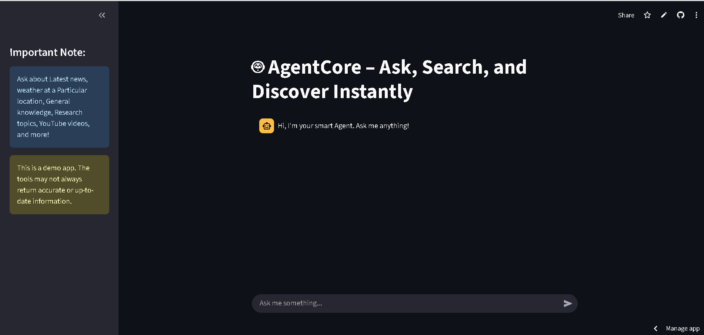

# 🤖 AgentCore — Ask, Search, and Discover Instantly
## 🚀 Live Demo: [Click Here](https://notesai-harsh-pilania.streamlit.app/)
## 📱DEMO Video: [Click Here](https://drive.google.com/file/d/1zafq_EU6Zat4WqX8z_0swKnBs2COPbjq/view?usp=sharing)

## Home page :



A powerful AI-powered agent built with Streamlit and LangChain that can search across multiple sources, provide weather information, and answer questions using various specialized tools.

## ✨ Features

### 🔍 **Multi-Source Search**
- **Web Search**: General web search using DuckDuckGo
- **News Search**: Latest news from Google News
- **YouTube Search**: Find relevant videos on YouTube
- **Academic Research**: Access to ArXiv papers
- **Wikipedia**: Quick access to encyclopedia information

### 🌤️ **Real-time Data**
- **Weather Information**: Get current weather for any location
- **Live Updates**: Real-time data from various APIs

### 🧠 **Intelligent Conversation**
- **Memory**: Maintains conversation context
- **Streaming Responses**: Real-time response generation
- **Error Handling**: Robust error management for reliable performance

## 🚀 Quick Start

### Prerequisites

- Python 3.8+
- OpenAI API Key
- Internet connection

### Installation

1. **Clone the repository**
   ```bash
   git clone https://github.com/yourusername/agentcore.git
   cd agentcore
   ```

2. **Install dependencies**
   ```bash
   pip install -r requirements.txt
   ```

3. **Set up your secrets**
   Create a `.streamlit/secrets.toml` file:
   ```toml
   OPENAI_API_KEY = "your-openai-api-key-here"
   ```

4. **Run the application**
   ```bash
   streamlit run agent.py
   ```

## 📋 Requirements

Create a `requirements.txt` file with the following dependencies:

```txt
streamlit>=1.28.0
langchain>=0.0.350
langchain-openai>=0.0.5
langchain-community>=0.0.10
openai>=1.0.0
requests>=2.31.0
arxiv>=1.4.0
wikipedia>=1.4.0
duckduckgo-search>=3.9.0
```

## 🛠️ Configuration

### OpenAI API Setup
1. Get your API key from [OpenAI Platform](https://platform.openai.com/api-keys)
2. Add it to your Streamlit secrets as shown above

### Weather API
The application uses the free Open-Meteo API for weather data. No additional setup required!

## 📱 Usage Examples

### 🔍 **General Queries**
```
"What are the latest developments in AI?"
"Explain quantum computing"
"Find YouTube videos about machine learning"
```

### 🌍 **Location-based Queries**
```
"What's the weather in New York?"
"Current temperature in Tokyo"
```

### 📰 **News and Research**
```
"Latest news about climate change"
"Research papers on neural networks"
"Recent developments in renewable energy"
```

## 🏗️ Architecture

```
┌─────────────────────────────────────────────────────────────┐
│                      Streamlit UI                          │
├─────────────────────────────────────────────────────────────┤
│                    LangChain Agent                         │
│                 (GPT-4o-mini powered)                      │
├─────────────────────────────────────────────────────────────┤
│                        Tools Layer                         │
│  ┌─────────┐ ┌─────────┐ ┌─────────┐ ┌─────────┐ ┌────────┐ │
│  │   Web   │ │  News   │ │YouTube  │ │ ArXiv   │ │Weather │ │
│  │ Search  │ │ Search  │ │ Search  │ │Research │ │  API   │ │
│  └─────────┘ └─────────┘ └─────────┘ └─────────┘ └────────┘ │
├─────────────────────────────────────────────────────────────┤
│                    External APIs                           │
│    DuckDuckGo | Google News | YouTube | Wikipedia | ArXiv  │
└─────────────────────────────────────────────────────────────┘
```

## 🎯 Available Tools

| Tool | Description | Example Usage |
|------|-------------|---------------|
| 🌐 **Web Search** | General web search via DuckDuckGo | "Latest iPhone reviews" |
| 📰 **News Search** | Current news from Google News | "Today's stock market news" |
| 🎥 **YouTube Search** | Find videos on YouTube | "Python tutorial videos" |
| 📚 **ArXiv Research** | Academic papers from ArXiv | "Machine learning research papers" |
| 📖 **Wikipedia** | Encyclopedia information | "History of artificial intelligence" |
| 🌤️ **Weather** | Current weather information | "Weather in San Francisco" |

## 🔧 Customization

### Adding New Tools

1. Create a new tool function:
```python
def custom_tool_func(query: str) -> str:
    # Your implementation here
    return result

custom_tool = Tool(
    name="Custom Tool",
    func=custom_tool_func,
    description="Description of your custom tool"
)
```

2. Add it to the tools list:
```python
tools = [duckduckgo, news_search, youtube_search, arxiv, wiki, weather_tool, custom_tool]
```

### Modifying the Model
Change the OpenAI model in the LLM initialization:
```python
llm = ChatOpenAI(
    model="gpt-4",  # or "gpt-3.5-turbo"
    temperature=0.7,  # Adjust creativity
)
```

## 🐛 Troubleshooting

### Common Issues

1. **"Module not found" errors**
   - Ensure all dependencies are installed: `pip install -r requirements.txt`

2. **OpenAI API errors**
   - Check your API key in `.streamlit/secrets.toml`
   - Verify you have sufficient API credits

3. **Search tools not working**
   - Check internet connection
   - Some searches may be rate-limited

4. **Memory issues**
   - Restart the Streamlit app to clear conversation memory

## 📈 Performance Tips

- The app uses streaming responses for better user experience
- Conversation memory is maintained throughout the session
- Error handling ensures the app continues running even if individual tools fail

## 🤝 Contributing

1. Fork the repository
2. Create a feature branch (`git checkout -b feature/amazing-feature`)
3. Commit your changes (`git commit -m 'Add amazing feature'`)
4. Push to the branch (`git push origin feature/amazing-feature`)
5. Open a Pull Request

## 📄 License

This project is licensed under the MIT License - see the [LICENSE](LICENSE) file for details.

## 🙏 Acknowledgments

- [LangChain](https://langchain.com/) for the agent framework
- [Streamlit](https://streamlit.io/) for the web interface
- [OpenAI](https://openai.com/) for the language model
- [Open-Meteo](https://open-meteo.com/) for weather data

## 📞 Support

If you encounter any issues or have questions:

1. Check the [Issues](https://github.com/yourusername/agentcore/issues) page
2. Create a new issue with detailed information
3. Join our [Discord community](https://discord.gg/your-link) for real-time help

---

<div align="center">

**Made with ❤️ by [Your Name](https://github.com/yourusername)**

[](https://github.com/yourusername/agentcore)
[](https://github.com/yourusername/agentcore/fork)

</div>

## 📸 Screenshots

### Main Interface


### Search Results


### Weather Information


---

*Built for developers, researchers, and anyone who needs quick access to information across multiple sources.*
